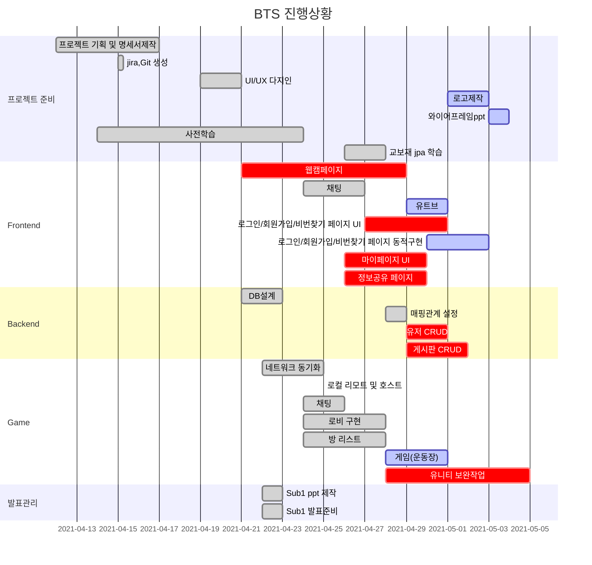

# 🏫 BTS(Back To School)
<div>
<p align="center">
  
  <br/><b>10대의 코딩 학습 공유 플랫폼</b>
  <p align="center">
 
 
 
 
 
 
 
 
 
 
 
  </p>
<br/>  
<br/> 
</p>    
</div>


> 서비스명: BTS       
> 팀명: 끄덕끄덕  
> 개발 기간: 2021.04.12 ~ 2021.05.28 (약 7주)       

## 📑 문서 
> [1️⃣SUB1_기획문서_1] https://www.notion.so/_SUB1-5fbe04ad315141db9f23d63805cd60dd        
> 
<br/>  
<br/> 

## 👨 팀원 역할   
| 이름   | 역할 | 내용                        |
| ------ | ---- | --------------------------- |
| 유진이 | 팀장 | 풀스택 개발, UI/UX디자인, 와이어프레임      |
| 김지형 | 팀원 | 프론트앤드 개발                        |
| 정다운 | 팀원 | 풀스택 개발, QA(Jira관리), UI/UX디자인 |
| 황호연 | 팀원 | 유니티 개발, QA(Jira관리), 영상제작    |
| 정혜지 | 팀원 | 프론트앤드 개발, 테스트케이스       |

<br/>  
<br/>    


## 📑 Gantt Chart     



<br/>  
<br/>     


## 📑 서비스 개요      
- 사회현상       


<br/>  
<br/>    


## 📑 주요 기능     

<br/>  
<br/> 


### 💻 주요 기능 미리보기   


<br/>  
<br/>     

## 📑 규칙     
### ✔ Branch 규칙  
```bash
develop - feature/기능명/fe or be       
```


<br/>

### ✔ Code Style
| FrontEnd   | BackEnd |
| ------ | ---- |
| 1. 폴더명: 첫글자 대문자<br/>→ ex) Feed/Add.vue <br/><br/>2. 파일명: 첫글자 대문자 <br/> → ex) Add.vue <br/><br/>3. 경로명: 소문자 → ex) /add | 1. 클래스명:  첫글자 대문자 + camel case <br/> ex) MainController.java <br/><br/> 2. 함수, 변수: 첫글자 소문자 + camel case <br/> ex) public void setUserName(); |
- ☑ 프론트앤드 규칙
    - 플러그인 : Vuetify 사용
    - css는 import해서 사용 -> style.css에서 공통속성 사용
    - 공통파일 수정 시 팀채널에 공유하기 
    - http파일 import해서 사용하기 


- ☑ 백앤드 명명규칙 
    - [참고] https://velog.io/@aidenshin/Java-%EC%9E%90%EB%B0%94-%EC%BD%94%EB%94%A9-%EA%B7%9C%EC%B9%99-Java-Code-Conventions#%EB%AA%85%EB%AA%85naming-%EA%B7%9C%EC%B9%99    


- if문
    - 한줄 일 때, Block 처리하기
    - else if / else /중괄호는 조건문 바로 옆에 붙이기

    ```java
    if(condition){
     statement;
    } else if(condition2){
     statement2;
    } else{
     statement3;
    }
    ```

- for
  
    - 단순 반복문은 iterator를 i,j,k,...,z순으로 명명하기
- 주석 상대방이 이해할 수 있도록 달기
    - /**/ 설명 여러줄 필요할 때 코드 위에 작성
    - // 간단한 주석 코드 옆에 작성


<br/>

### ✔ 포트번호    

```
프론트 : 8000
백 : 8080
게임 : 8081
DB : 3306
Jenkins : 9090
```

<br/>

### ✔ commit 규칙    

📌 하나의 기능 완성되면 한번에 커밋

```
git commit -m "{지라이슈번호} [작업분류] : {FE or BE} - 작업커밋내용"
git commit -m "S04P22B107-56 [feat] : BE_0415 - AWS RDS, S3 서버 및 기본환경 세팅"

**프론트** : "{지라이슈번호 하나}_[작업분류] : FE_날짜:완성한 기능(작업내용)" 
		ex) S04P22B107-56_ [feat] : FE_0118:피드작성 컴포넌트 추가/수정/삭제

**백** : "{지라이슈번호 하나}_[작업분류] : BE_날짜: 완성한 기능(작업내용)" 
		ex) S04P22B107-56__ [feat] : BE_0118: 피드작성 컴포넌트 추가/수정/삭제

**리드미** : "README_날짜: 수정한 부분" 
		ex) S04P22B107-56_ [feat] : README_0118: 와이어프레임 수정

```
```
[ 작업 분류 ]
- feat : 새로운 기능 추가
- fix : 버그 수정
- docs : 문서 수정
- style : 코드 포맷팅, 세미콜론 누락, 코드 변경이 없는 경우
- refactor : 코드 리펙토링
- test : 테스트 코드, 리펙토링 테스트 코드 추가
- chore : 빌드 업무 수정, 패키지 매니저 수정
```
<br />


## 📑산출물  
> 1. ER 다이어그램     
> 2. 와이어프레임  

### ✔ ER 다이어그램      


### ✔ 와이어프레임    


<br />


