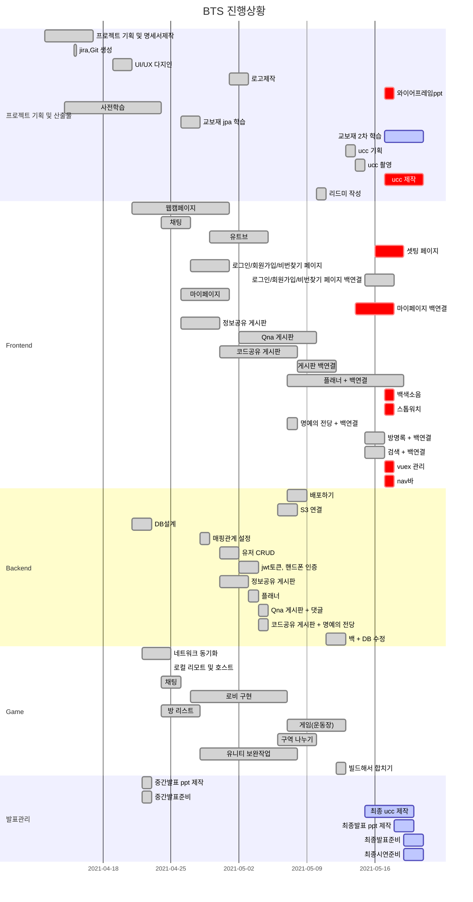

# 🏫 BTS(Back To School)
<div>
<p align="center">
  
  <br/><b>Z세대를 위한 학습 메타버스 플랫폼</b>
  <p align="center">
 
 
 
 
 
 
 
 
 
 
 
  </p>
<br/>  
<br/> 
</p>    
</div>


> 서비스명: BTS       
> 팀명: 끄덕끄덕  
> 개발 기간: 2021.04.12 ~ 2021.05.28 (약 7주)       

## 📑 문서 
> [1️⃣기획문서](https://www.notion.so/_SUB1-5fbe04ad315141db9f23d63805cd60dd)   
> [2️⃣개발문서](https://www.notion.so/BTS_2-6fe1e0b0cc4949078da839c07f24dd55)     
> 
<br/>  
<br/> 

## 👨 팀원 역할   
| 이름   | 역할 | 내용                        |
| ------ | ---- | --------------------------- |
| 유진이 | 팀장 | 풀스택 개발, UI/UX디자인, 와이어프레임      |
| 김지형 | 팀원 | 프론트앤드 개발                        |
| 정다운 | 팀원 | 풀스택 개발, QA(Jira관리), UI/UX디자인 |
| 황호연 | 팀원 | 유니티 개발, QA(Jira관리), 영상제작    |
| 정혜지 | 팀원 | 프론트앤드 개발, 테스트케이스       |

<br/>  
<br/>    


## 📑 Gantt Chart     



<br/>  
<br/>     


## 📑 서비스 개요      
코로나19로 인해 최근 비대면 공부 플랫폼과 메타버스와 같은 컨텐츠 규모가 급부상하고 있는 사회현상에 맞추어 자신의 일상을 친구들과 함께 참여하는 것을 선호하는 Z세대를 대상으로 단순한 공부 플랫폼이 아닌 친구들과 일상을 공유함으로써 비대면의 일상화를 기대할 수 있는 학습 메타버스 플랫폼입니다.  


<br/>  
<br/>    


## 📑 주요 기능     
* **회원가입/로그인 기능**  
  
  > a. 사용자 회원정보를 받아 핸드폰인증 후 회원가입에 성공한다.  
  >
  > b. 가입 후 웹캠, 마이크, 스피커 상태를 초기 세팅한다.
  >

* **방(학교)생성 및 리스트**
  
  > a. 로그인 후 로비에서 방(학교)을 생성하고 생성된 방(학교)에 들어갈 수 있다.
  >
  > b. 비밀방을 체크하여 암호화 할 수 있다.
  >
  > c. 나의 캐릭터 설정 및 배경음악 조절이 가능하며, 조작법을 볼 수 있다. 
  >
  > d. 각 방(학교)에는 학교 이름, 제한인원이 표시된다.
  >

* **게임 맵(유니티)**  
  > a. 방(학교)에 입장하면 전체 게임 맵이 보이고 본인의 캐릭터를 방향키로 이동할 수 있다.
  >
  > b. 현재 접속 중인 학생들과 실시간으로 채팅할 수 있다.
  >
  > c. 방의 컨셉에 따라 위치에 따른  도움말 기능이 제공된다.
  
* **화상미팅 기능**
  > a. 학교 맵에 들어가서 교실, 급식실, 휴게실에 들어가면 트리거(F키)를 통해 웹캠이 공유되면서 화상미팅이 시작된다
  >
  > b. 미팅에 참여중인 학생들과 함께 실시간으로 채팅이 가능하다.  
  >
  > c. 현재 접속중인 학생들의 활동 상태를 "온라인/자리비움/방해금지"로 확인할 수 있다.  
  >
  > d. 화면공유 버튼을 눌러 현재 나의 모니터 화면을 다른 학생들에게 실시간으로 공유할 수 있다.  
  >
  > e. 이외에도 음소거/화면 끄기 기능이 제공된다.  

* **웹(학교 공간) 기능**
  > a. 컴퓨터 교실에서는 웹캠, 오디오, 웹채팅을 지원하며 정보공유/Qna/코드공유 게시판에서 마크다운 언어를 사용한다.
  >
  > b. 정보공유 게시판에서는 학습하며 정리한 내용을 학생들과 함께 공유할 수 있다.  
  >
  > c. Qna 게시판에서는 질의응답을 할 수 있는 플랫폼이 제공된다.
  >
  > d. 코드공유 게시판에서는 알고리즘 문제를 풀면서 풀리지 않았던 문제를 공유할 수 있고, 코드 컴파일러를 실행해 제출한 코드를 컴파일하고 성공 여부, 실행 시간, 메모리 등을 확인할 수 있다.
  >
  > e. 코드를 하나 제출하면 50p가 적립되며 100p단위로 레벨이 올라간다. 로비의 명예의 전당에서 상위 랭킹 10명의 학생을 확인할 수 있다.   
  >
  > f. 3개의 게시판 모두 검색이 가능하다.
  >
  > g. 도서관에서는 플래너 게시판이 마크다운 언어로 제공되고, 공부 쓴소리 영상(유튜브), 백색소음 선택 기능, 스톱워치 기능 등이 제공된다.  
  >
  > h. 급식소에서는 웹캠, 화면공유, 웹채팅을 지원하며 추천 영상(유튜브 인기 영상)을 제공한다.  
  >
  > i. 운동장/광장에서는 학생들과 함께 즐길 수 있는 게임이 제공된다.  
  >
  > j. 휴게실에서는 웹캠, 오디오, 웹채팅을 지원한다.  
  >
  > k. 로비에 방명록에서는 학생들이 로그인한 기록을 확인할 수 있으며, 명예의 전당에서 등수를 확인할 수 있다.  

<br/>  
<br/> 

## 📑 실행방법     
### ✔ 포트번호    

```
프론트 : 8000
백 : 8080
게임 : 8081
DB : 3306
Jenkins : 9090
```
<br/><br/>

### ✔ 실행순서
> 1. 서버 접속 : ssh -i K4B107T.pem ubuntu@k4b107.p.ssafy.io        
> 2. 프론트 실행 : sudo service nginx start     
> 3. 폴더 이동 : cd /var/www/html     
> 4. 백앤드 실행 : sudo java -jar bts-0.0.1-SNAPSHOT.jar     

<br/><br/>

## 📑 규칙     
### ✔ Branch 규칙  
```bash
develop - feature/기능명/fe or be       
```


<br/><br/><br/>

### ✔ Code Style
| FrontEnd   | BackEnd |
| ------ | ---- |
| 1. 폴더명: 첫글자 대문자<br/>→ ex) Feed/Add.vue <br/><br/>2. 파일명: 첫글자 대문자 <br/> → ex) Add.vue <br/><br/>3. 경로명: 소문자 → ex) /add | 1. 클래스명:  첫글자 대문자 + camel case <br/> ex) MainController.java <br/><br/> 2. 함수, 변수: 첫글자 소문자 + camel case <br/> ex) public void setUserName(); |
- ☑ 프론트앤드 규칙
    - 플러그인 : Vuetify 사용
    - css는 import해서 사용 -> style.css에서 공통속성 사용
    - 공통파일 수정 시 팀채널에 공유하기 
    - http파일 import해서 사용하기 


- ☑ 백앤드 명명규칙 
    - [참고](https://velog.io/@aidenshin/Java-%EC%9E%90%EB%B0%94-%EC%BD%94%EB%94%A9-%EA%B7%9C%EC%B9%99-Java-Code-Conventions#%EB%AA%85%EB%AA%85naming-%EA%B7%9C%EC%B9%99)  


- if문
    - 한줄 일 때, Block 처리하기
    - else if / else /중괄호는 조건문 바로 옆에 붙이기

    ```java
    if(condition){
     statement;
    } else if(condition2){
     statement2;
    } else{
     statement3;
    }
    ```

- for
  
    - 단순 반복문은 iterator를 i,j,k,...,z순으로 명명하기
- 주석 상대방이 이해할 수 있도록 달기
    - /**/ 설명 여러줄 필요할 때 코드 위에 작성
    - // 간단한 주석 코드 옆에 작성


<br/>
<br/>


### ✔ commit 규칙    

📌 하나의 기능 완성되면 한번에 커밋

```
git commit -m "{지라이슈번호} [작업분류] : {FE or BE} - 작업커밋내용"
git commit -m "S04P22B107-56 [feat] : BE_0415 - AWS RDS, S3 서버 및 기본환경 세팅"

**프론트** : "{지라이슈번호 하나}_[작업분류] : FE_날짜:완성한 기능(작업내용)" 
		ex) S04P22B107-56_ [feat] : FE_0118:피드작성 컴포넌트 추가/수정/삭제

**백** : "{지라이슈번호 하나}_[작업분류] : BE_날짜: 완성한 기능(작업내용)" 
		ex) S04P22B107-56__ [feat] : BE_0118: 피드작성 컴포넌트 추가/수정/삭제

**리드미** : "README_날짜: 수정한 부분" 
		ex) S04P22B107-56_ [feat] : README_0118: 와이어프레임 수정

```
```
[ 작업 분류 ]
- feat : 새로운 기능 추가
- fix : 버그 수정
- docs : 문서 수정
- style : 코드 포맷팅, 세미콜론 누락, 코드 변경이 없는 경우
- refactor : 코드 리펙토링
- test : 테스트 코드, 리펙토링 테스트 코드 추가
- chore : 빌드 업무 수정, 패키지 매니저 수정
```
<br />


## 📑산출물  
> 1. ER 다이어그램     
> 2. 와이어프레임  

### ✔ ER 다이어그램      
    


### ✔ 와이어프레임    
> [XD 바로가기](https://xd.adobe.com/view/9c9f0544-d27c-4e7f-98c7-b88dbd335c41-c9cc/)    

   
코드를 가장 많이 푼 상위 랭킹 10위까지의 학생들을 확인할 수 있습니다.   

  
최신 유튜브 리스트 정보를 제공받을 수 있습니다.  

  
화상미팅에서 나의 모니터 화면을 실시간으로 공유할 수 있습니다.   

  
캘린더에서 주간/월간 플랜을 작성하고 관리할 수 있습니다.  

   
정보 또는 코드를 학생들과 공유할 수 있습니다. 코드 공유게시판에서는 풀리지 않는 알고리즘 문제를 풀고, 다른 학생들이 제출한 코드 목록을 확인하여 비교할 수 있습니다.  

   
공부를 하다가 모르는 것이 생겼을때 QnA게시판에 질문을 올리고, 다른 학생들로 부터 답변을 받을 수 있습니다.   

<br />


